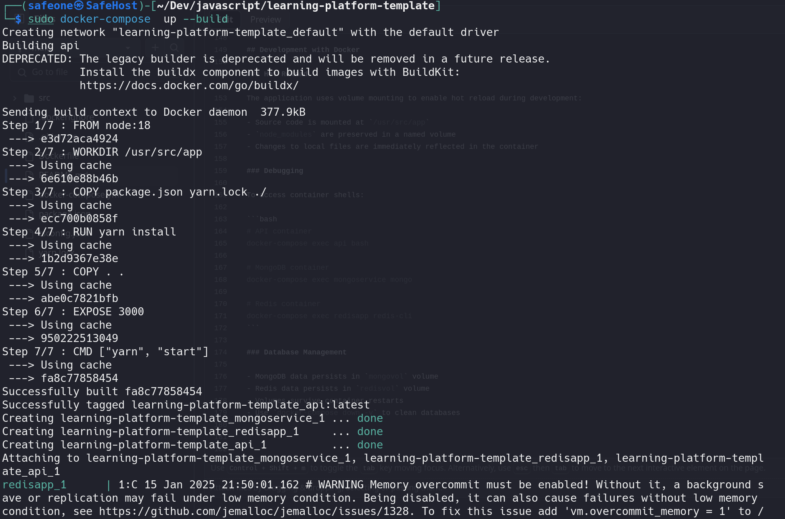
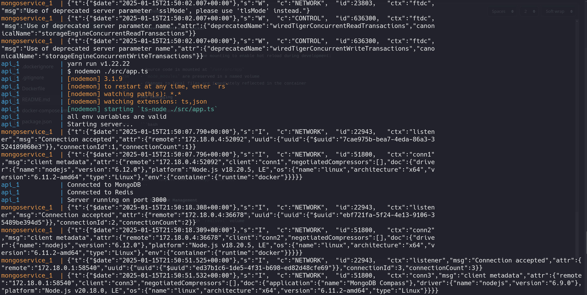
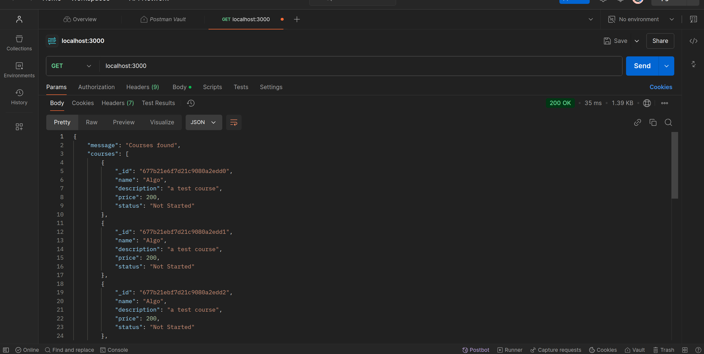
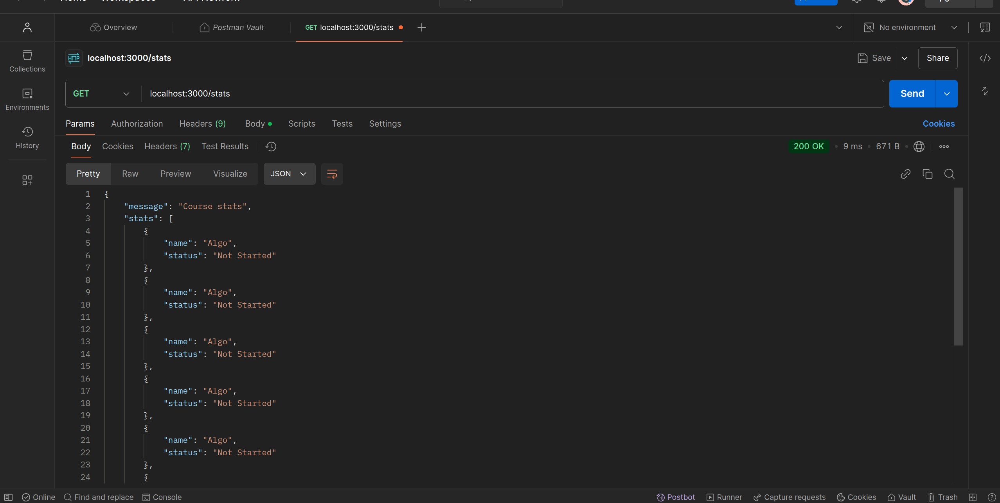
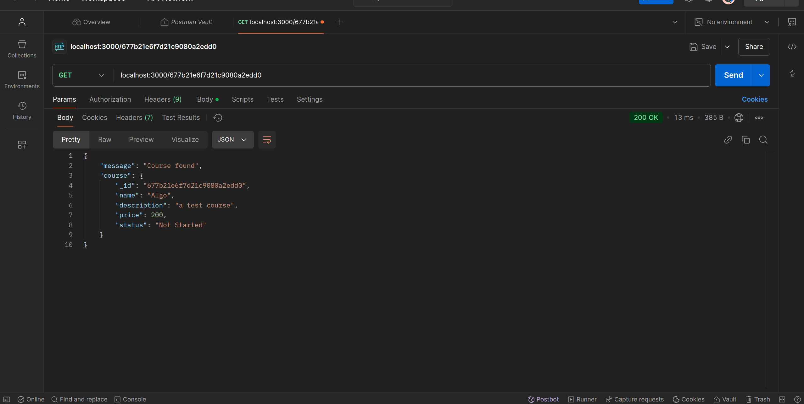
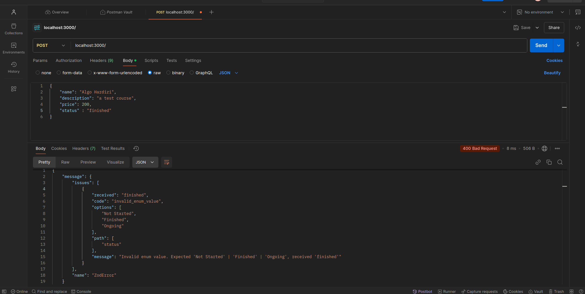
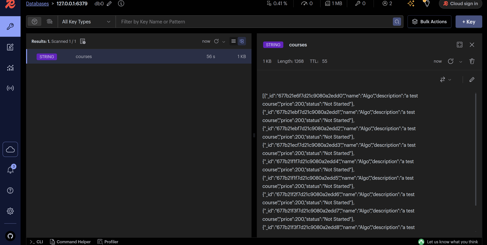

# Learning Platform API Documentation

## Project Overview

The Learning Platform API is a robust backend service designed to power an online learning management system. This API enables the creation, management, and delivery of educational content while handling user authentication, course management, and progress tracking.

### Technology Stack

- **Node.js**: Runtime environment for executing JavaScript code
- **Express**: Web application framework for handling HTTP requests
- **TypeScript**: Adds static typing to JavaScript for better code quality
- **MongoDB**: NoSQL database for storing course and user data
- **Redis**: In-memory data store for caching and session management
- **Zod** : Zod is a TypeScript-first schema declaration and validation library

## Project Structure

```
/learning-platform-template
├── docker-compose.yml
├── Dockerfile
├── image-2.png
├── image-3.png
├── node_modules
├── package.json
├── README.md
├── src
│   ├── app.ts
│   ├── config
│   │   ├── db.ts
│   │   ├── env.ts
│   │   └── types.ts
│   ├── controllers
│   │   └── courseController.ts
│   ├── routes
│   │   └── courseRoutes.ts
│   └── services
│       ├── mongoService.ts
│       └── redisService.ts
├── tsconfig.json
└── yarn.lock
```

### Accepted Routes

The following routes are available for managing courses:

- `GET /`: Get a list of all courses
- `POST /`: Create a new course
- `GET /stats`: Retrieve courses status
- `GET /:id`: Get details of a specific course by ID

## Installation and Setup

### Docker Setup (Recommended)

The application is containerized using Docker, making it easy to set up and run in any environment.

#### Prerequisites

- Docker
- Docker Compose

#### Docker Services

1. **MongoDB Service (`mongoservice`)**

   - Uses official MongoDB image
   - Exposed on port 27017
   - Persistent data storage using named volume `mongovol`

2. **Redis Service (`redisapp`)**

   - Uses official Redis image
   - Exposed on port 6379
   - Persistent data storage using named volume `redisvol`

3. **API Service (`api`)**
   - Built from local Dockerfile
   - Exposed on port 3000
   - Hot-reload enabled with volume mounting
   - Dependencies handled through volume mounting

#### Running with Docker Compose

1. Clone the repository:

   ```bash
   git clone https://github.com/safeone1/learning-platform-nosql.git
   cd learning-platform-api
   ```

2. Create environment file:

   ```bash
   cp .env.example .env
   ```

3. Configure environment variables in `.env`:

   ```
   DATABASE_URL="mongodb://mongoservice:27017/"
   MONGODB_DB_NAME="SafeDb"
   REDIS_HOST="redisapp"
   REDIS_PORT="6379"
   PORT="3000"
   ```

   Note: Use service names (`mongoservice` and `redisapp`) as hostnames instead of localhost.

4. Start the services:

   ```bash
   docker-compose up -d
   ```

5. View logs:
   ```bash
   docker-compose logs -f
   ```

#### Docker Compose Configuration

```yaml
version: "3.8"

services:
  mongoservice:
    image: mongo
    ports:
      - "27017:27017"
    volumes:
      - mongovol:/data/db

  redisapp:
    image: redis
    ports:
      - "6379:6379"
    volumes:
      - redisvol:/data

  api:
    build: ./
    ports:
      - "3000:3000"
    depends_on:
      - mongoservice
    volumes:
      - .:/usr/src/app
      - /usr/src/app/node_modules
    env_file:
      - .env

volumes:
  mongovol:
  redisvol:
```

#### Useful Docker Commands

- Start services: `docker-compose up -d`
- Stop services: `docker-compose down`
- View logs: `docker-compose logs -f [service_name]`
- Rebuild API: `docker-compose build api`
- Rebuild and restart API: `docker-compose up -d --build api`
- Remove volumes: `docker-compose down -v`

## Development with Docker

### Hot Reload

The application uses volume mounting to enable hot reload during development:

- Source code is mounted at `/usr/src/app`
- `node_modules` are preserved in a named volume
- Changes to local files are immediately reflected in the container

### Debugging

To access container shells:

```bash
# API container
docker-compose exec api bash

# MongoDB container
docker-compose exec mongoservice mongo

# Redis container
docker-compose exec redisapp redis-cli
```

### Database Management

- MongoDB data persists in `mongovol` volume
- Redis data persists in `redisvol` volume
- Volumes survive container restarts
- Use `docker-compose down -v` to clean databases

### Demo

runing the docker compose



app is running on port 3000



get request to /



get request to /stats



get request to /:id with `id = 677b21e6f7d21c9080a2edd0`



Error detection using Zod



Post request to / to add course


checking redis cached data using redis insight


